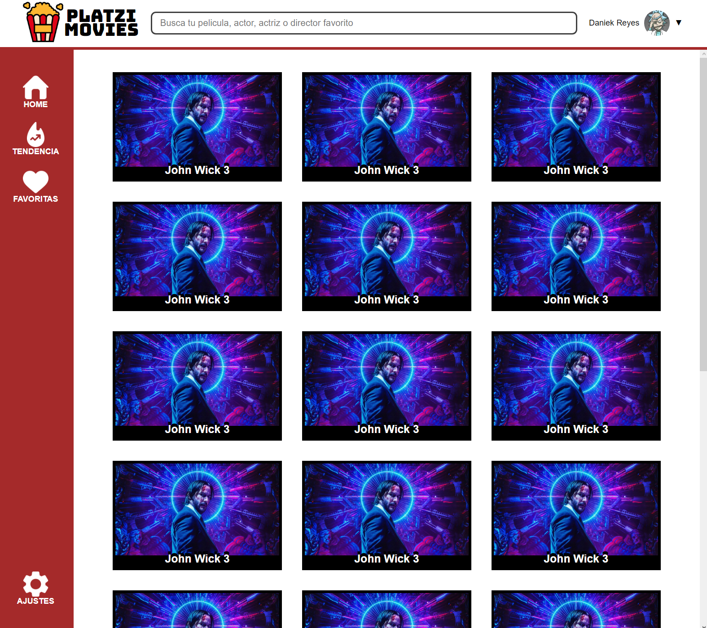

# Platzi-Movies
Reto del curso de CSS Grid Layout

## Características
* Solo se hizo uso de **HTML y CSS.**
* La estructura fue maquetada con **Grid.**
* El organizacion del contenido de todas las secciones se realizo con **Flexbox.**
* Aún esta en proceso los media query para mejorar **responsive design.**

## Resultado y enlace directo.

